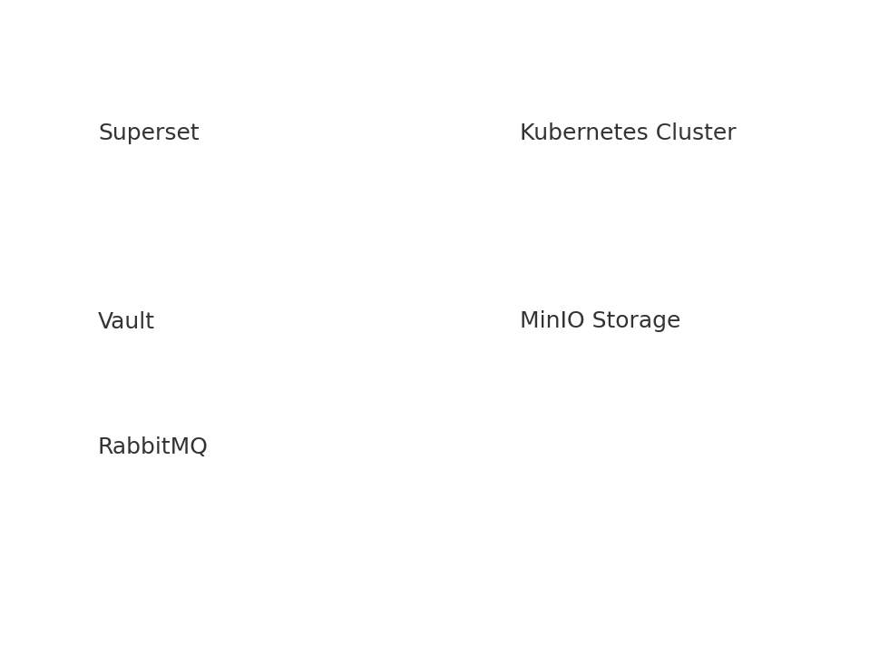

# Azure On-Prem Open Source Alternatives

This repository contains installation and configuration guides for open‑source, on‑premises replacements for Azure cloud services.

## Architecture Diagram

The diagram below illustrates the system architecture.

**Files:**
- `onprem_architecture.drawio`
- `onprem_architecture.png`

1. Apache Superset\
Apache Superset serves as an open-source business intelligence platform for data exploration and visualization, connecting to SQL databases to create interactive dashboards and charts. Engineers start by installing OS dependencies, Python virtual environment, and Superset itself on Ubuntu, then initialize the metadata database with superset db upgrade and create an admin user. Finally, run superset init for roles and launch the service on port 8088 to access the UI for building no-code visualizations and SQL queries.​

2. Proxmox VE
Proxmox VE provides open-source virtualization using KVM for VMs and LXC for containers, ideal for managing on-premise infrastructure clusters. Download the ISO, boot the server, and follow the installer to set hostname, IP, storage, and root password, then reboot to access the web UI at port 8006. Add storage pools like ZFS or Ceph, and optionally create a cluster with pvecm create for high availability across nodes.​

3. MinIO
MinIO delivers high-performance, S3-compatible object storage for scalable data lakes on local hardware. Download the binary, make it executable, and start the server pointing to a data directory like /data to expose ports 9000 and 9001. Access the console to create access keys, buckets, policies, and enable TLS for secure multi-tenant operations mimicking cloud storage.​

4. Wazuh
Wazuh offers open-source SIEM for threat detection, log analysis, and compliance monitoring across endpoints and clouds. Run the all-in-one installer script to deploy indexer, manager, and dashboard in minutes on a single host. Use the web UI to onboard agents, tune detection rules, and integrate log sources like syslog or cloud APIs for real-time alerts.​

5. NetBox + FRRouting
NetBox acts as a network Source of Truth for IPAM, DCIM, and device inventory, while FRRouting handles dynamic routing protocols like BGP and OSPF. Install NetBox with PostgreSQL/Redis backend, configure Gunicorn/Nginx, then model sites, VLANs, and devices; separately install FRR packages and edit configs for protocols before restarting. Integrate NetBox data with FRR via automation tools like Ansible for orchestrated network provisioning.​

6. Kubernetes (Upstream)
Upstream Kubernetes orchestrates containers at scale using kubeadm for cluster management. On the control plane, install containerd/kubeadm, initialize with kubeadm init, and set up kubectl; join workers using the generated token, then deploy CNI like Calico. Configure Ingress, RBAC, and metrics-server to run production workloads with pod autoscaling and service discovery.​

7. Apache Atlas
Apache Atlas enables data governance through metadata management, lineage tracking, and classification for big data ecosystems. Install Java/Kafka/HBase dependencies, unpack the binary, configure hooks to data platforms, and start with atlas_start.py. Define entity types, integrate with Hive/Spark for automatic metadata capture, and secure via LDAP for enterprise compliance.​

8. Local LLM Stack (Ollama or LM Studio)
Local LLM stacks like Ollama run open models for private AI inference without cloud dependency. Install the tool, pull models like Llama3 via CLI/GUI, and enable REST API for integration. Set up systemd services for auto-start, preload models, and expose endpoints for RAG or agentic workflows in air-gapped environments.​

9. MongoDB
MongoDB functions as a distributed NoSQL document database for flexible schema applications. Install via apt, enable the service, and optionally bind to all interfaces in config for remote access. Create admin users, initiate replica sets across nodes for HA, and tune sharding for horizontal scaling of high-write workloads.​

10. RabbitMQ
RabbitMQ implements robust message queuing with AMQP support for decoupled microservices. Install the server package, enable the management plugin, and access the UI on port 15672 to set vhosts/users. Declare exchanges/queues/bindings, enable TLS and HA mirrors for reliable event-driven architectures.​

11. HAProxy
HAProxy excels as a TCP/HTTP load balancer with advanced health checks and SSL termination. Install the package, edit haproxy.cfg for frontends/backends/ACLS, and validate syntax before restarting. Monitor stats socket for real-time metrics and tune algorithms like leastconn for distributing traffic across app servers.​

12. Harbor
Harbor provides an enterprise container registry with vulnerability scanning and replication. Install Docker/Compose, run the installer after editing harbor.yml for hostname/TLS, then access the UI. Create projects, enable Trivy scanning, and set replication to sync images across clusters securely.​

13. Teleport CE
Teleport CE secures access to infrastructure via certificate-based SSH/K8s proxies without bastions. Install the RPM, configure teleport.yaml for auth/proxy roles, and start services. Enroll nodes, define RBAC roles, and use tsh CLI for audited just-in-time access across dynamic environments.​

14. HashiCorp Vault
Vault centralizes secrets management with dynamic credentials and encryption-as-a-service. Install the package, configure storage/listener, initialize/unseal, then enable KV engine. Write policies for apps, integrate via auth methods like Kubernetes for lease-based secrets rotation.​

15. ELK Stack
ELK Stack (Elasticsearch/Logstash/Kibana) ingests, searches, and visualizes logs at scale. Install from Elastic repos in sequence, configure Logstash pipelines for parsing, and secure Elasticsearch with TLS/RBAC. Deploy Beats agents to ship metrics/logs, then build Kibana dashboards for observability.​

16. Bacula
Bacula manages backups with client/server architecture for file/system images. Install server/client/console packages, configure directors/jobs/storage in INI files. Schedule incremental/full backups to disk/tape, verify restores, and monitor via bconsole for data protection SLAs.​
